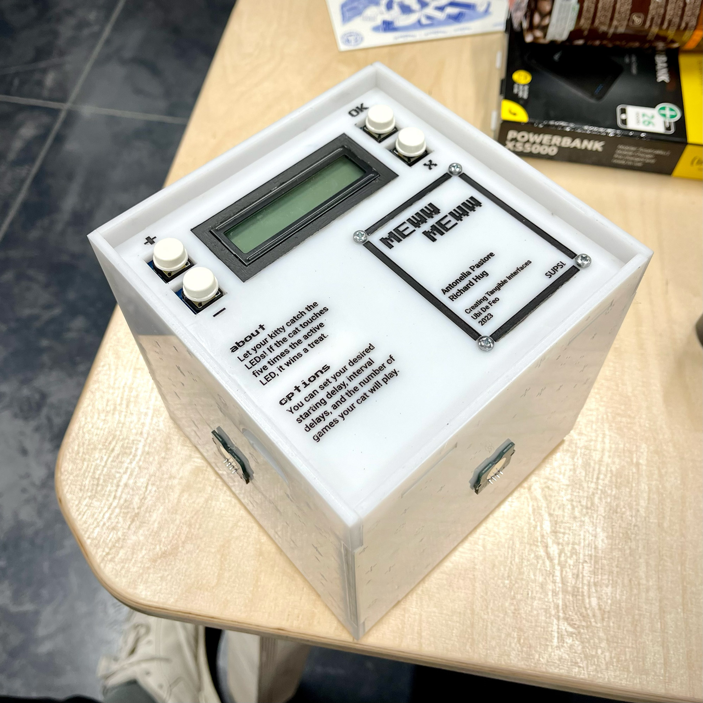
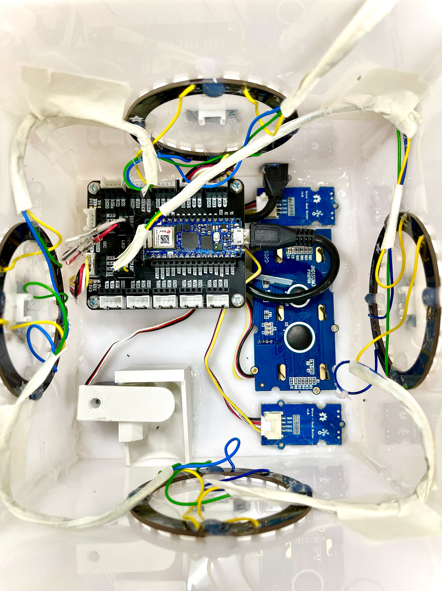
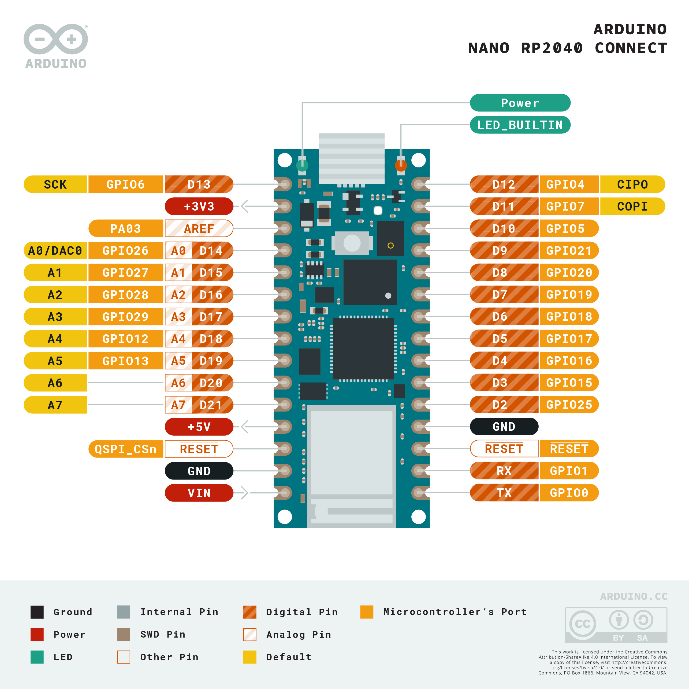
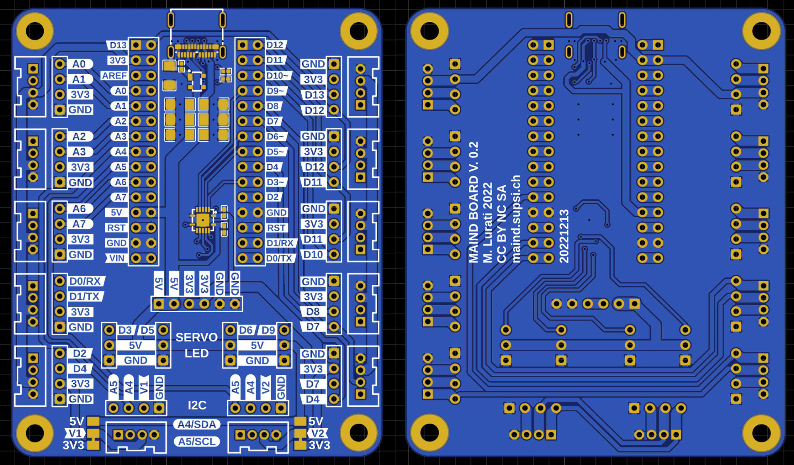

# Meww Meww

Let your kitty catch the LEDs! If the cat touches five times the active LED, it wins a treat. You can set your desired starting delay, interval delays, and the number of games your cat will play. The game was designed as a 15cm cube with all sides out of white acryl. There are 5 touch sensors, 5 LED rings, 4 buttons, an LCD screen and a servo motor - all working together to make the game fun to play for cats. :-)

This project was built by Antonella Pastore and me during a course led by [Ubi de Feo](http://www.ubidefeo.com/).

Arduino, Python files and other assets are stored in the folder `assets`.

## Product Overview

Meww Meww has six faces - 1 for humans (cat owners) and 5 for cats (human owners - since they may rule over us anyway?). The bottom is where humans interact with the object. It is used to program various options and start the game. The other sides are where the game occurs. The sides are engraved with patterns inspired by Nyan Cat - a meme you should know about. The bottom is engraved with some text explaining the game and the options. We also added legends for the buttons and some more project details, like our names.

## Inside Meww Meww

Here you go with a fancy shot of the insides of Meww Meww. The Arduino board is elevated a little from the bottom to have additional space to hide cables. A pipe starts on the top face and ends on top of a small closing lid visible on the lower left. This lid is attached to a servo motor, opens whenever a treat should be dispensed, and closes after a few milliseconds. The LED rings are all connected to a single port. A cable extension is connected to a side face to charge the battery or access the board.

## Arduino (RP2040) & Carrier Layout

For this project we used an Arduino RP2040 and a carrier designed by [Marco Lurati](https://marcolurati.ch/).

